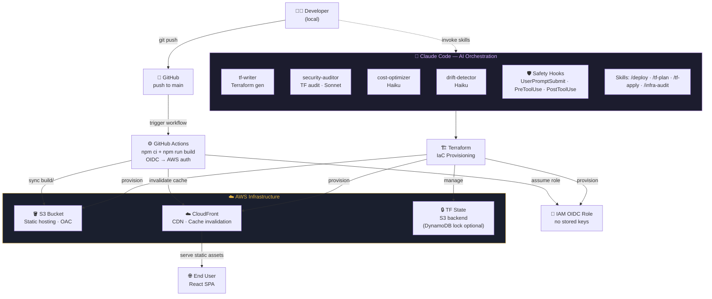

# My React App — AWS DevOps Capstone


**Live site:** https://d255xh9kackac4.cloudfront.net

A React 19 portfolio app deployed to AWS using S3 + CloudFront, provisioned with Terraform, automated via GitHub Actions with OIDC keyless authentication, and orchestrated entirely by Claude Code as the AI engine.

---

## Architecture



---

## Tech Stack

| Layer | Technology | Purpose |
|---|---|---|
| Frontend | React 19 | UI component |
| Hosting | AWS S3 | Static file storage |
| CDN | AWS CloudFront | HTTPS + global delivery |
| Auth | AWS IAM + OIDC | Keyless CI/CD authentication |
| Encryption | AES256 (SSE-S3) | S3 object encryption |
| IaC | Terraform | Infrastructure provisioning |
| CI/CD | GitHub Actions | Auto-deploy on push to main |
| AI Engine | Claude Code | Agentic DevOps orchestration |

---

## Project Structure

```
my-react-app/
├── src/                        # React source code
├── public/                     # Static assets
├── terraform/                  # All AWS infrastructure
│   ├── main.tf                 # S3 + CloudFront + encryption
│   ├── github-oidc.tf          # OIDC provider + IAM role
│   ├── variables.tf
│   ├── outputs.tf
│   ├── providers.tf
│   └── backend.tf              # S3 remote state (optional)
├── .github/
│   └── workflows/
│       └── build-deploy.yaml   # CI/CD pipeline
├── .claude/
│   ├── agents/                 # security-auditor, cost-optimizer, drift-detector, tf-writer
│   ├── skills/                 # /tf-plan, /tf-apply, /deploy, /infra-audit, etc.
│   ├── hooks/                  # Safety guards
│   ├── settings.json           # Hooks configuration
│   └── settings.local.json     # AWS credentials (gitignored)
├── .mcp.json                   # MCP servers (AWS + Terraform)
└── CLAUDE.md                   # Claude Code instructions
```

---

## Claude Code Features

### Skills
| Skill | Purpose |
|---|---|
| `/scaffold-terraform` | Generates all Terraform files from scratch |
| `/tf-plan` | Runs terraform plan + risk analysis |
| `/tf-apply` | Runs terraform apply + verifies deployment |
| `/deploy` | Builds React app and syncs to S3 + invalidates CloudFront |
| `/setup-gh-actions` | Creates or validates the GitHub Actions workflow |
| `/infra-audit` | Parallel security + cost + drift audit |
| `/infra-status` | Health dashboard of all resources |

### Subagents
| Agent | Model | Tools | Purpose |
|---|---|---|---|
| `security-auditor` | Sonnet | Read | Audits Terraform for security issues |
| `cost-optimizer` | Haiku | Read | Finds cost optimization opportunities |
| `drift-detector` | Haiku | Bash, Read | Detects infrastructure drift |
| `tf-writer` | Sonnet | Read, Write | Generates production-quality Terraform |

### Hooks
| Hook | Event | Guards Against |
|---|---|---|
| `user-prompt-guard` | UserPromptSubmit | Destructive prompts (nuke, wipe, delete all) |
| `pre-tool-guard` | PreToolUse | Dangerous commands (terraform destroy, aws s3 rm) |
| `post-tool-logger` | PostToolUse | Logs every terraform apply to deploy.log |

### MCP Servers
- **AWS MCP** — Claude queries live AWS resources directly
- **Terraform MCP** — Claude looks up provider docs from the official registry

---

## CI/CD Flow

Every push to `main` triggers the pipeline automatically:

```yaml
- uses: aws-actions/configure-aws-credentials@v4
  with:
    role-to-assume: arn:aws:iam::092443461861:role/my-react-app-github-actions-role

- run: npm ci && npm run build
- run: aws s3 sync build/ s3://my-react-app-production-site --delete
- run: aws cloudfront create-invalidation --distribution-id E1BFQPCLMEHGE --paths "/*"
```

No AWS access keys stored anywhere — OIDC issues a temporary 1-hour token scoped to this repo and main branch only.

---

## Security

- S3 bucket is fully private — accessible only via CloudFront OAC
- HTTPS enforced — HTTP redirects to HTTPS automatically
- OIDC authentication — no long-lived AWS credentials
- IAM least privilege — only S3 sync + CloudFront invalidation permissions
- AES256 encryption at rest on all S3 objects

---

## Local Development

```bash
npm install --no-bin-links        # VMware shared folder workaround
npm start                         # Run dev server
```

> **Note:** On VMware hgfs use `node node_modules/react-scripts/bin/react-scripts.js build` instead of `npm run build`

---

## Infrastructure Workflow

```bash
# New infrastructure
cd terraform && terraform plan
cd terraform && terraform apply

# Via Claude Code skills
/tf-plan      # preview
/tf-apply     # apply
/infra-audit  # security + cost + drift check
```

---

Built by **Diego Valdez** · Powered by React, AWS & Claude Code · 2026
